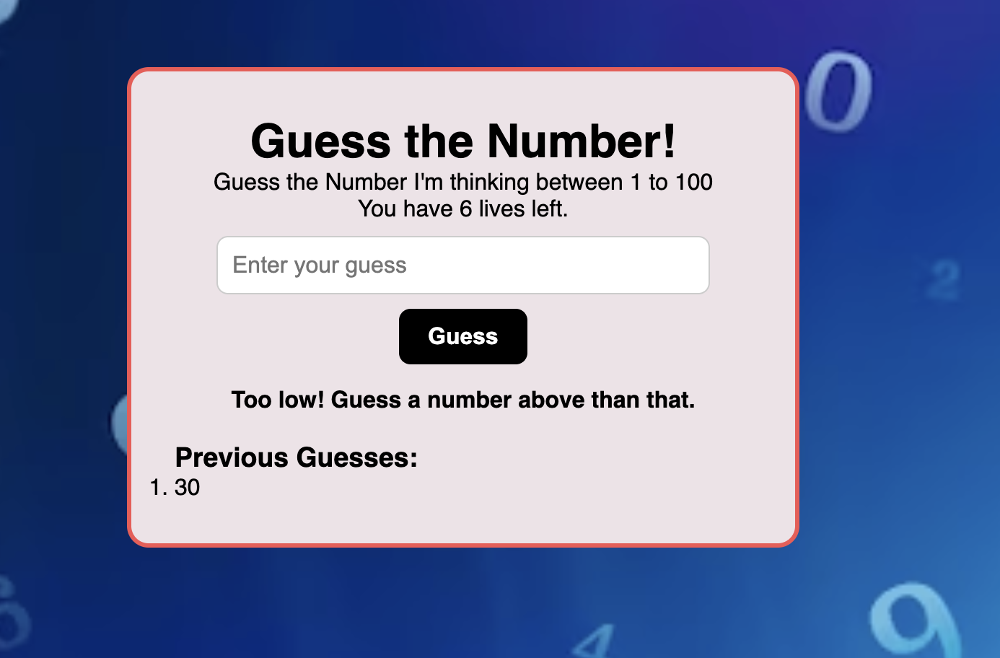
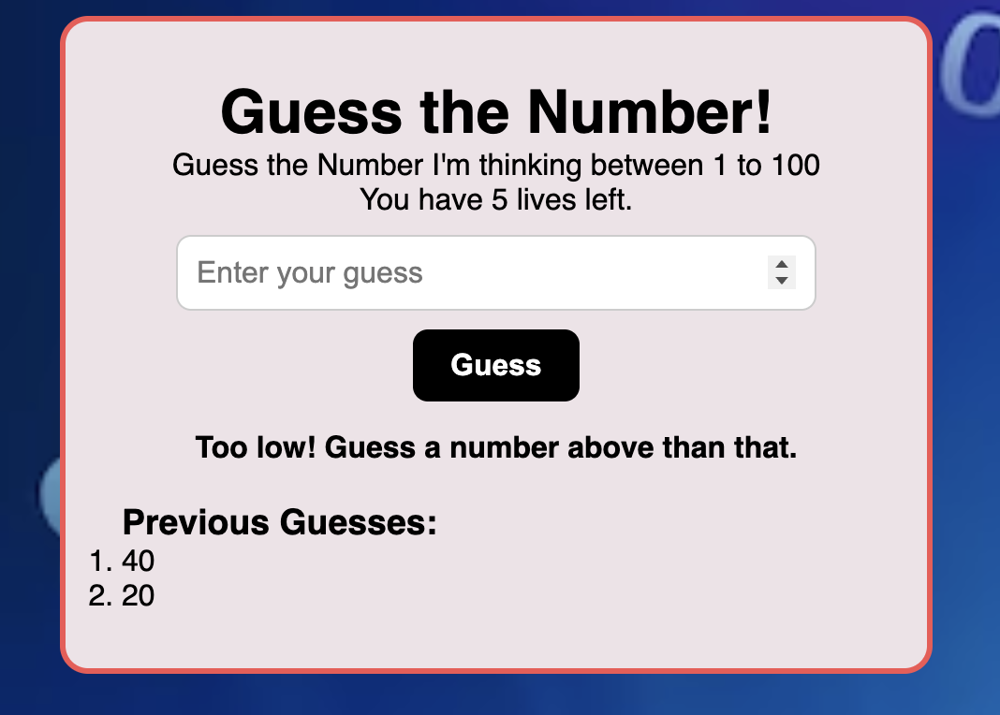
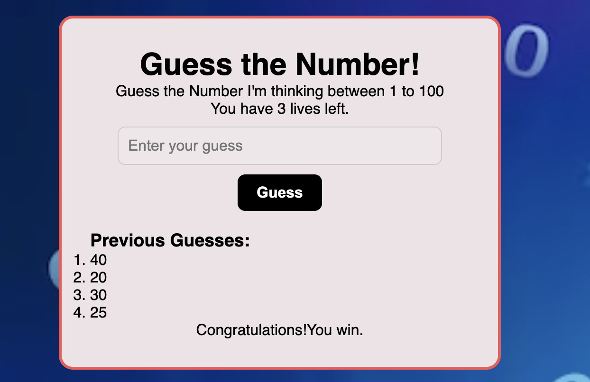

Guess The Number Game
A simple web-based game where the player tries to guess a randomly generated number between 1 and 100. The player has 7 lives (attempts) to guess correctly. After each guess, the game provides hints whether the guess is too high or too low. Previous guesses and remaining lives are displayed.

Screenshots: 

