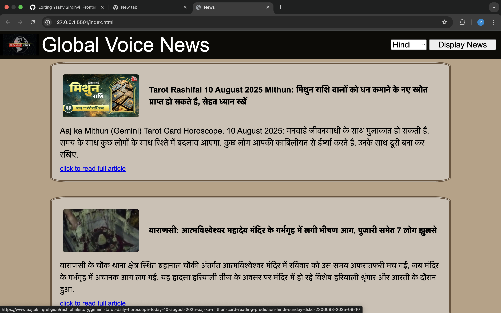
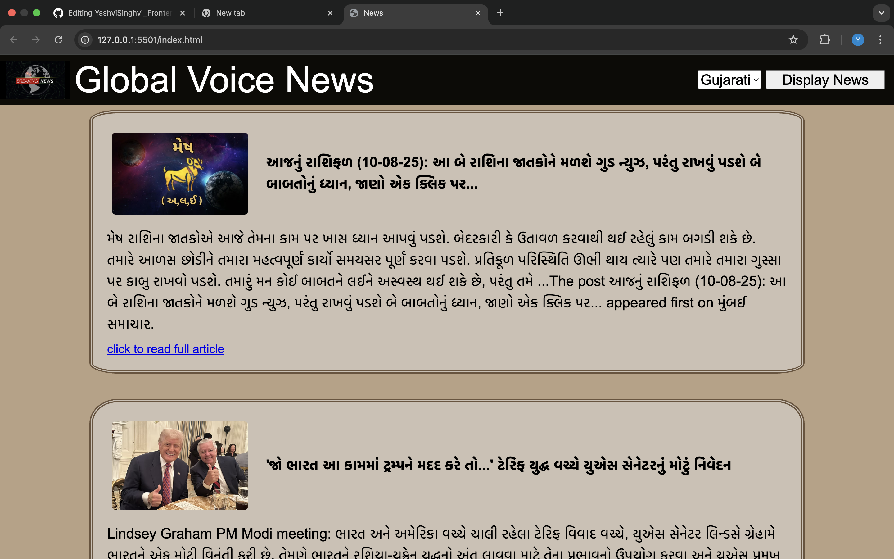

Global Voice News
Global Voice News is a web-based news platform that fetches and displays the latest news articles from around the world. Users can stay updated on current events with real-time headlines, images, and summaries. 

Main features:
The user can change the language to view news of that language.
Used API to fetch information. 
Added transitions and animations. 

Screenshots: 

